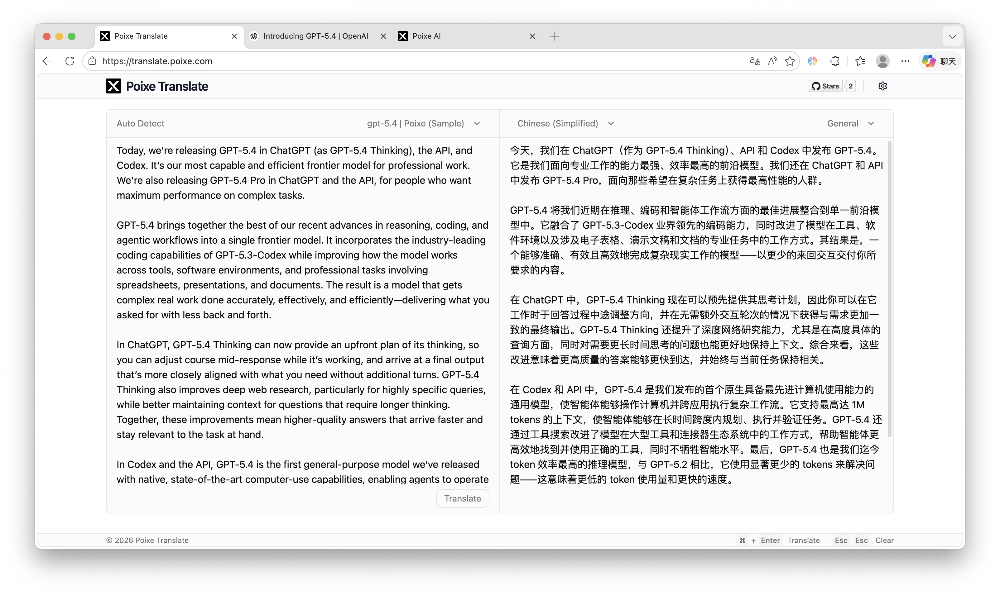

<div align="center">
  <a href="https://github.com/poixeai/translate">
    
  </a>
  <h1>Poixe Translate</h1>
  <p>一款基于 AI 大模型的轻量化 Web 翻译工具</p>

[English](./README.md) / 简体中文

  <p>
    <a href="https://github.com/poixeai/translate/blob/main/LICENSE">
      
    </a>
    <a href="https://github.com/poixeai/translate">
      
    </a>
    <a href="https://github.com/poixeai/translate/stargazers">
      
    </a>
    <a href="https://github.com/poixeai/translate/issues">
      
    </a>
  </p>

  <h4>
    <a href="https://translate.poixe.com">演示网站</a>
    <span> · </span>
    <a href="#-开始使用">快速开始</a>
    <span> · </span>
    <a href="#-部署">部署教程</a>
    <span> · </span>
    <a href="#-支持的 AI 模型">支持模型</a>
    <span> · </span>
    <a href="#-支持的翻译语言">翻译语言</a>
  </h4>
  
  
</div>

---

Poixe Translate 是一个基于 AI 大模型的开源 Web 翻译工具。所有配置数据均存储在浏览器本地，所有模型请求均由浏览器直接发起，保障隐私与密钥安全。自定义 AI 模型厂商，支持 4 种主流接口协议与 186 种语言，并支持用户自定义翻译提示词，以满足从日常交流到专业领域的精准翻译需求。

## 功能特性

- **浏览器本地请求**：所有模型请求均直接在浏览器中发起，保障用户隐私与密钥安全。
- **支持自定义模型提供商**：可自定义模型厂商，配置 API Endpoint、API Key、接口协议和模型列表，自由切换模型。
- **支持 4 种主流 AI 接口协议**：可接入不同 AI 服务商或兼容平台，灵活扩展。
- **支持自定义翻译提示词**：支持自定义提示词（Prompts），用户可根据专业领域（如法律、IT、医学）或特殊口吻自由定制翻译逻辑，实现高度精准的上下文翻译。
- **支持 186 种翻译语言**：覆盖自然语言、地区语言变体、方言、古语言以及部分人造语言等多种语言类型。
- **支持 15 种 UI 界面语言**：适合全球化使用和开源分发。
- **主题切换**：支持系统主题跟随，也支持手动切换。
- **部署方便**：可直接静态部署，也支持 Docker、Vercel、Nginx、宝塔面板等多种方式。
- **本地持久化存储**：通过 IndexedDB 保存配置数据，提升使用体验。

## 技术栈

本项目基于现代 Web 技术栈构建，确保高性能与良好的开发体验：

- React
- Vite
- TypeScript
- shadcn/ui
- Tailwind CSS 
- Dexie.js (IndexedDB)

## 开始使用

使用本工具无需复杂的注册流程，只需完成基础配置即可开始翻译：

1. **配置模型厂商**：点击右上角设置按钮，进入配置页面，添加一个模型提供商（Provider），填入对应厂商的 Endpoint、API Key，选择对应的接口协议，输入支持的模型列表。
2. **选择模型**：在主界面，选择需要使用的 AI 模型，也就是上一步骤配置好的模型。
3. **选择目标语言**：在主界面，选择需要翻译的目标语言，支持 186 种语言。
4. **选择翻译提示词**：在主界面，选择内置的翻译提示词（如：金融、通用），或使用自定义的提示词以约束翻译风格。
5. **执行翻译**：在输入框内输入需要翻译的内容，点击翻译按钮即可获取结果。

> 图文教程参见 [使用教程（图文版本）](docs/cn/guild.md)。

## 支持的 AI 模型

Poixe Translate 当前支持 4 种主流 AI 接口协议，可接入兼容这些协议的平台、模型服务或自建网关。

### 已支持的接口协议

| 名称 | 路径 | 官方文档 |
|---|---|---|
| OpenAI Chat Completions | `/v1/chat/completions` | [官方文档](https://developers.openai.com/api/reference/resources/chat) |
| OpenAI Responses | `/v1/responses` | [官方文档](https://developers.openai.com/api/reference/resources/responses/methods/create) |
| Anthropic Messages | `/v1/messages` | [官方文档](https://platform.claude.com/docs/en/api/messages/create) |
| Google Gemini Generate Content | `/v1beta/models/{model}:generateContent` | [官方文档](https://ai.google.dev/gemini-api/docs/text-generation?hl=zh-cn) |

### 可接入的模型服务

只要你的服务商兼容上述协议，通常都可以接入，例如：

* OpenAI
* Anthropic Claude
* Google Gemini
* DeepSeek
* Grok
* Qwen
* 自建兼容网关
* 其他模型聚合平台

### 配置模型厂商时需要填写

* Name
* API Endpoint
* API Key
* API Style
* Model List

这意味着你可以根据自己的需求自由切换不同模型来源，而不被绑定在单一平台。

## 支持的翻译语言

Poixe Translate 当前支持 **186 种翻译语言**，覆盖全球主流语言及多种地区语言变体，可满足日常交流、学习、工作与专业场景下的翻译需求。

以下仅列举部分支持语言：

- English
- 简体中文
- 繁體中文
- 日本語
- 한국어
- Français
- Deutsch
- Español
- Português
- Русский
- العربية
- हिन्दी
- Bahasa Indonesia
- Italiano
- Nederlands

> 完整语言列表请以应用内实际支持内容为准。

## 部署

Poixe Translate 是一个纯前端项目，部署方式非常灵活。你可以选择 Docker、Vercel、宝塔面板或手动部署。

### Docker

**方式一：从 Dockerfile 构建**

```bash
# 克隆源码
git clone https://github.com/poixeai/translate.git
cd translate

# 构建镜像
docker build -t poixeai/translate:latest .

# 运行容器
docker run -d \
  -p 8080:80 \
  --name poixe-translate \
  --restart=always \
  poixeai/translate:latest
```

访问 `http://localhost:8080`

```bash
# 查看日志
docker logs -f poixe-translate

# 删除容器
docker rm -f poixe-translate
```

**方式二：使用 Docker Compose**

```bash
# 克隆源码
git clone https://github.com/poixeai/translate.git
cd translate

# 启动
docker compose up -d

# 停止
docker compose down

# 重新构建并启动
docker compose up -d --build
```

**方式三：从 Docker Hub 拉取**

```bash
docker pull terobox/translate:latest

docker run -d \
  -p 8080:80 \
  --name poixe-translate \
  --restart=always \
  terobox/translate:latest
```

### Vercel

如果你希望以最省事的方式快速上线，可以直接部署到 Vercel。点击按钮一键部署，零配置。

[](https://vercel.com/new/clone?repository-url=https://github.com/poixeai/translate&repository-name=poixe-translate)

### 宝塔面板

> 参见 [宝塔面板部署指南](docs/deploy-bt.md)。

### 手动部署

```bash
# 安装依赖
npm install

# 构建生产版本
npm run build
```

构建产物位于 `dist/` 目录，部署到任意静态文件服务器（Nginx、Caddy、Apache 等）即可。

## 贡献

欢迎提交 Issue 和 Pull Request。

## 开源协议

本项目采用 [MIT License](./LICENSE) 开源协议。