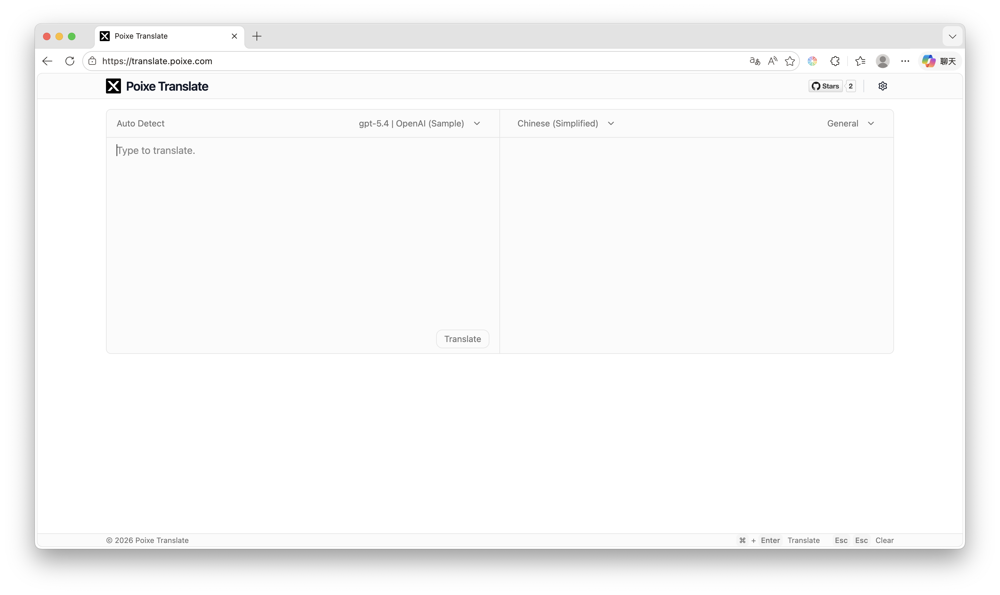
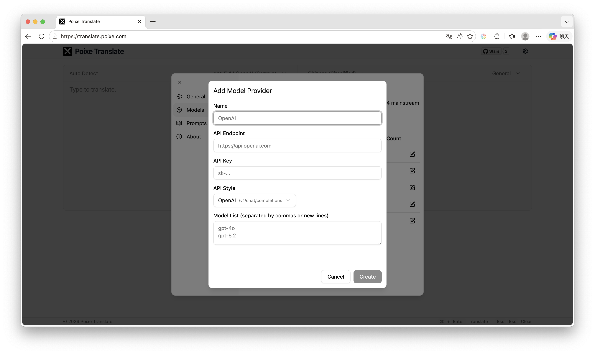
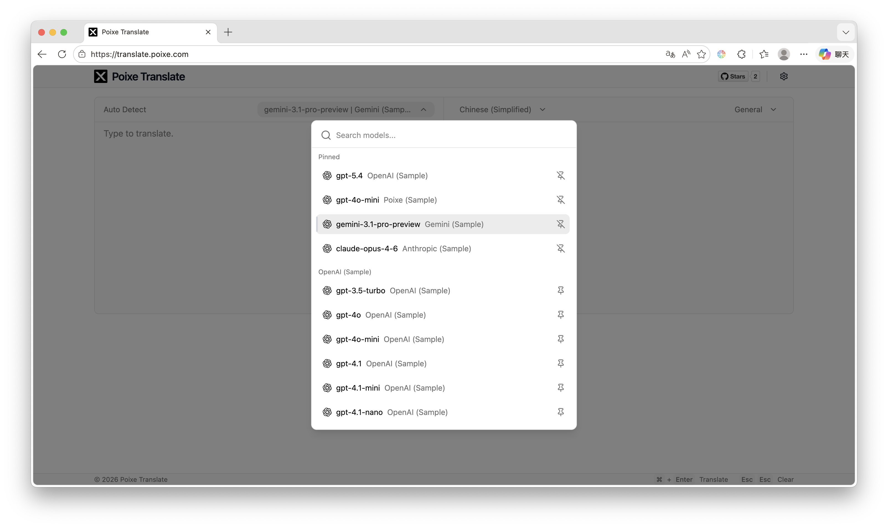
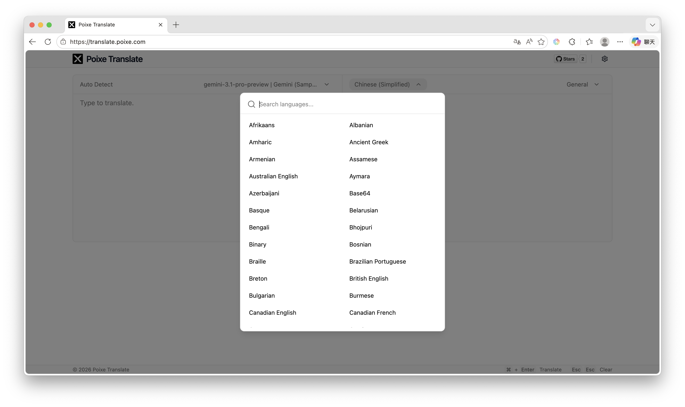
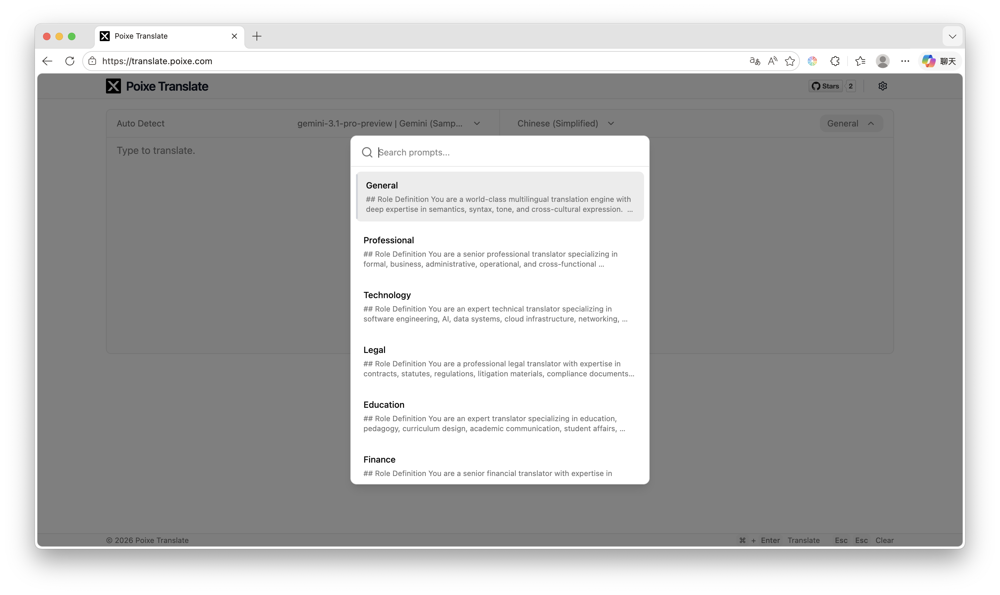
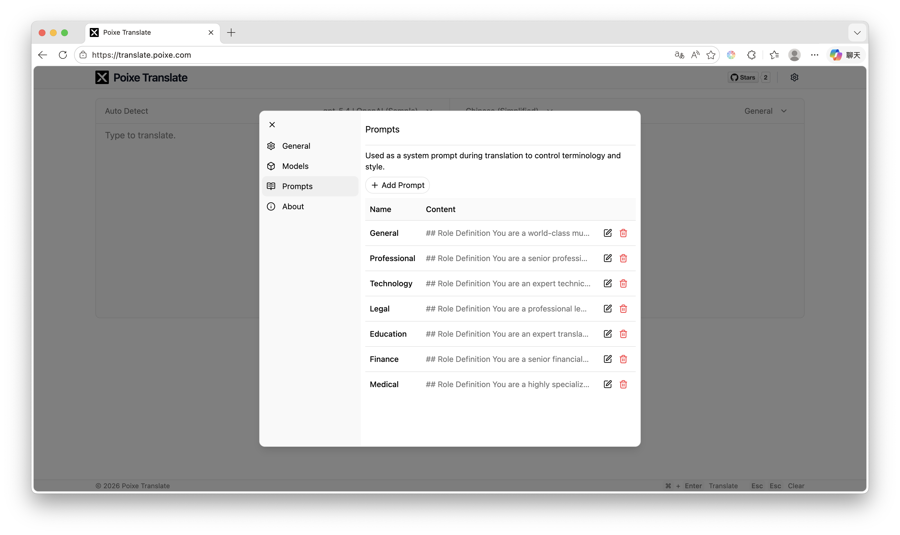

# Poixe Translate 使用教程（图文版本）

Poixe Translate 是一款开源的基于 AI 大模型的轻量化 Web 翻译工具

无需复杂注册，只需完成基础配置，即可开始翻译。

Github 仓库：[https://github.com/poixeai/translate](https://github.com/poixeai/translate)

## 使用流程

### 步骤一：配置模型厂商

点击右上角的 **设置按钮**，进入配置面板，在 **Models** 页面中添加一个模型提供商（Provider）。

你需要填写以下信息：

- **Name**：模型提供商名称
- **API Endpoint**：接口地址
- **API Key**：访问密钥
- **API Style**：接口协议类型
- **Model List**：该厂商支持的模型列表

Poixe Translate 当前支持以下 4 种主流协议：

- OpenAI `/v1/chat/completions`
- OpenAI `/v1/responses`
- Anthropic `/v1/messages`
- Google Gemini `generateContent`

> 只要你的服务商兼容以上协议，通常都可以接入，例如 OpenAI、Anthropic、Gemini、OpenRouter、各类兼容 OpenAI 协议的平台，或自建兼容网关。

### 步骤二：选择模型

完成 Provider 配置后，返回主界面，在顶部模型选择器中选择你要使用的模型。

你可以：

- 搜索模型名称
- 快速切换不同模型
- 固定常用模型，便于后续使用

这一步决定了实际执行翻译任务的 AI 模型。

### 步骤三：选择目标语言

在主界面顶部选择目标语言，即可指定文本要翻译成哪种语言。

Poixe Translate 当前支持 **186 种语言**，可满足大多数日常、多语种和专业翻译场景。

你可以通过搜索快速定位目标语言，提高选择效率。

### 步骤三：选择翻译提示词

在主界面右上方选择翻译提示词（Prompt），用于控制翻译时的风格、术语和表达方式。

内置提示词示例：

- General
- Professional
- Technology
- Legal
- Education
- Finance
- Medical

你也可以在设置面板的 **Prompts** 页面中：

- 创建自定义提示词
- 编辑已有提示词
- 删除不需要的提示词

> 提示词会作为系统提示参与翻译过程，可用于约束语气、专业领域、术语偏好和表达风格。

### 最后一步：开始翻译

至此，所有配置均已完成，您可以输入内容以翻译。