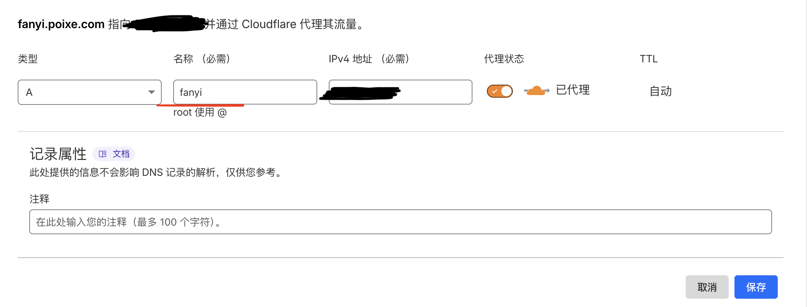
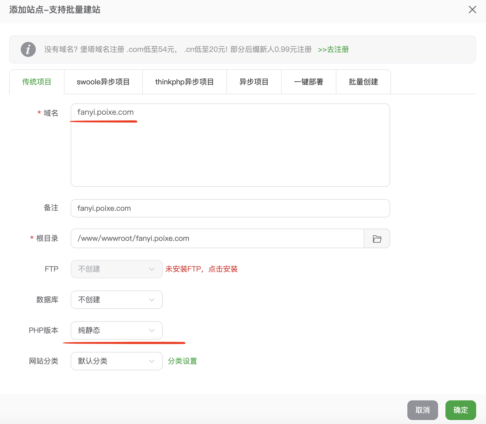
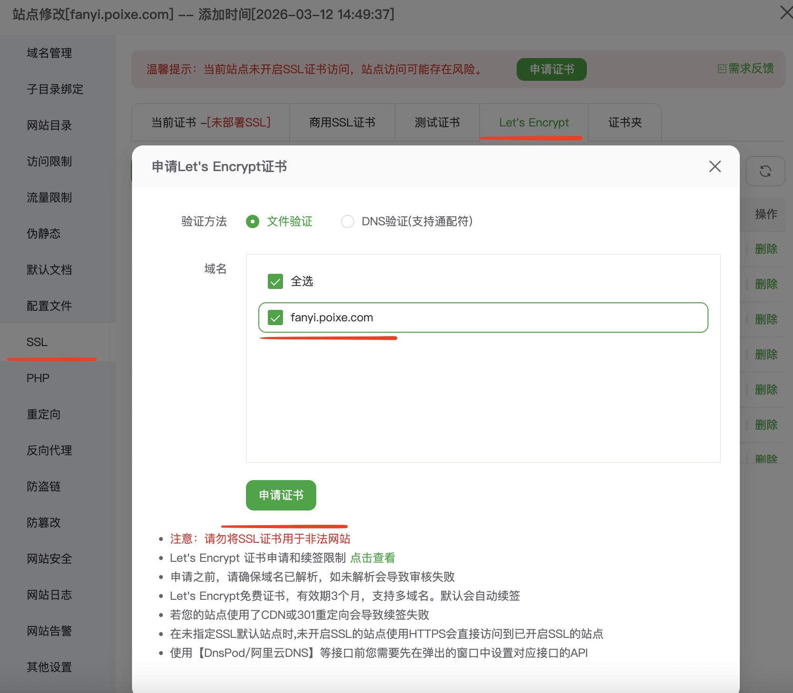
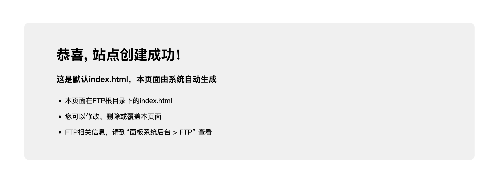
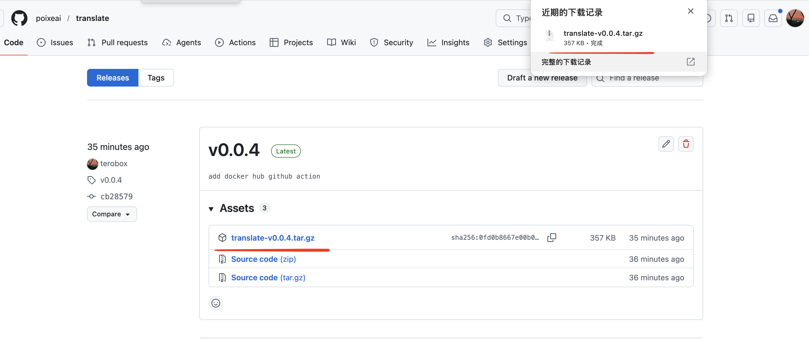
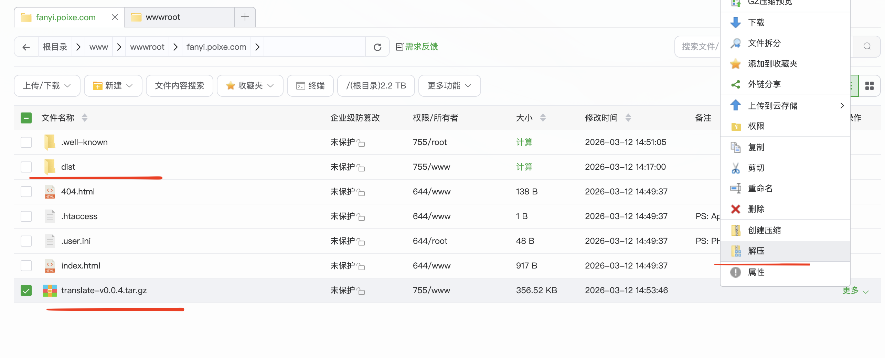
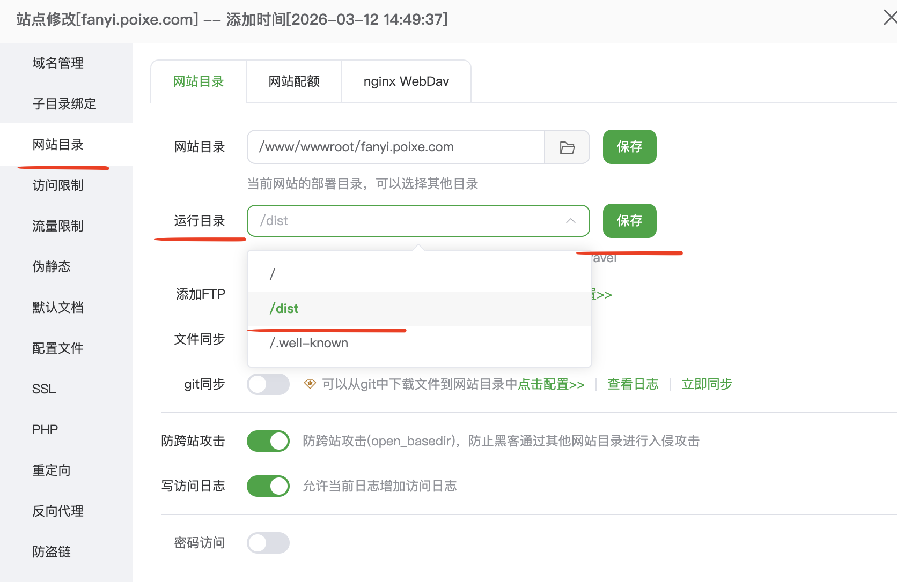
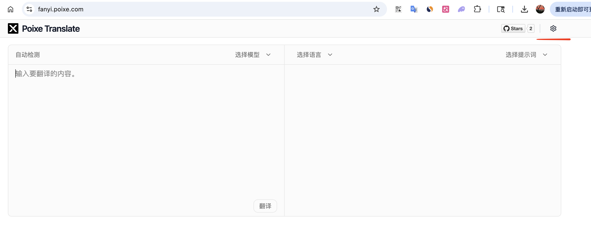

# Deploying Poixe Translate with aaPanel

> This guide is intended for deploying Poixe Translate using aaPanel.
>
> The aaPanel version used in this demonstration is v11.2.0.

## Prerequisites

Before getting started, please make sure you have prepared the following:

* A server with aaPanel installed
* A domain name already pointed to your server
* Nginx installed
* The built frontend files of Poixe Translate
* If you need to configure AI models, please prepare your own API keys

## Deployment Steps

Step 1: Configure DNS records (using Cloudflare as an example).

Step 2: Open aaPanel, go to **Websites**, and click **Add Site**.

Step 3: Go to the site's **SSL** page, apply for an SSL certificate, and enable HTTPS.

Step 4: Check whether the website is accessible and confirm that the DNS and Nginx configuration have taken effect.

Step 5: Open the [GitHub Releases](https://github.com/poixeai/translate/releases) page and download the latest frontend build package.

Step 6: Go to the site directory, upload the packaged frontend files to the website root directory, and extract them.

Step 7: Adjust the configuration and update the **Run Directory** to `/dist`.

Step 8: After completing the configuration, visit your domain directly and confirm that the page opens properly.

